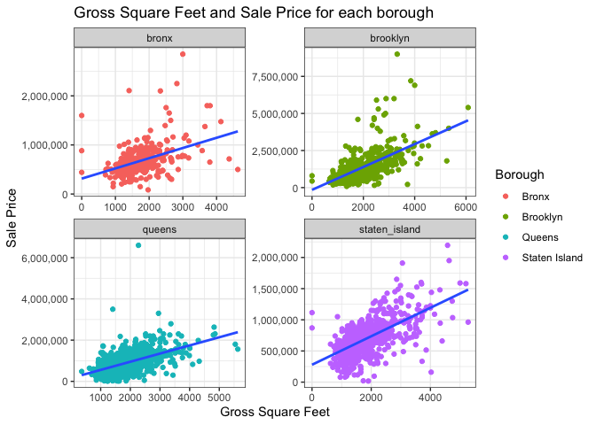
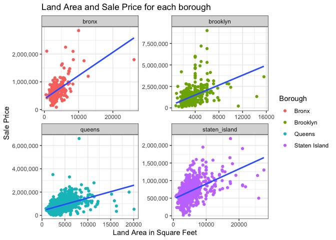
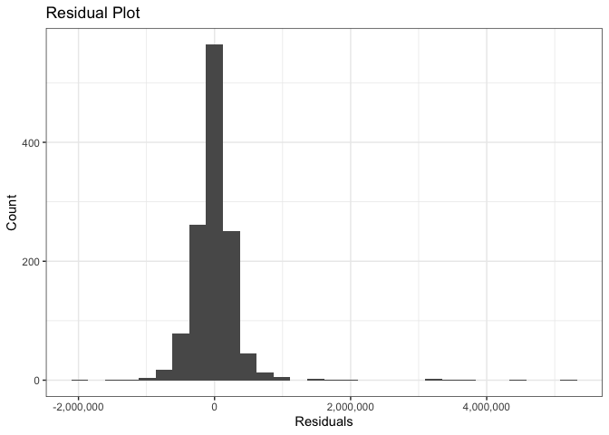

Predicting House Sale Prices in NYC
================
Brendan Octaviano
29/01/2022

# Introduction

New York City is not just the city that we know it all for based on
movies - it is a very large city with a lot to offer for those who live
there. With the 5 different boroughs in New York City (Manhattan, Bronx,
Brooklyn, Queens and Staten Island), there are almost [9
million](https://www.census.gov/quickfacts/fact/table/newyorkcitynewyork#)
residents, all of whom need somehwere to reside.

Coming from Australia, due to the COVID-19 pandemic and work from home
orders, there have been a large number of people choosing to move away
from major cities in cramped apartments, and opt to live in a much more
spacious home. Due to the rapidly increasing prices for inner-city
residence, and also the desire to live a more spacious lifestyle, the
[Australian Bureau of Statistics confirmed that capital cities saw a net
loss of 11,200 people in the September quarter of 2020
alone](https://www.abc.net.au/news/2021-02-02/abs-data-confirms-city-exodus-during-covid/13112868).

# Our Data

Analysing data from the [NYC Department of
Finance](https://www1.nyc.gov/site/finance/taxes/property-rolling-sales-data.page),
it would be interesting to explore if a related trend is occurring in
New York City through the following question:

1.  How well does the size of a house explain or predict sale price
    across New York City?

NYC Department of Finance uploaded the data for each individual borough,
so it was important to clean the data and merge it all so that we could
perform a meaningful analysis. We will be focusing specifically on
houses who fall under the “A1” category, which are two story homes that
are not connected to any other residence, and considered small or
medium, with or without an attic. Unfortunately, but also
unsurprisingly, Manhattan only had 3 of these kinds of homes, therefore
it has been excluded from our analysis.

``` r
#Loading our packages
set.seed(1)
library(tidyverse)
library(knitr)
library(janitor)
library(readxl)
library(ggcorrplot)
library(tidymodels)

#Loading the data
#Manhattan 
manhattan <- read_excel("rollingsales_manhattan.xlsx",
                        #Using skip = 4 to skip the first 4 rows with unnecessary data
                        skip = 4)
#Bronx
bronx <- read_excel("rollingsales_bronx.xlsx",
                    skip = 4)
#Brooklyn
brooklyn <- read_excel("rollingsales_brooklyn.xlsx",
                       skip = 4)
#Queens
queens <- read_excel("rollingsales_queens.xlsx",
                     skip = 4)
#Staten Island
staten_island <- read_excel("rollingsales_statenisland.xlsx",
                            skip = 4)

#Creating our merged data
nyc_property_data <- bind_rows(manhattan, bronx, brooklyn, queens, staten_island) %>%
  #Ensuring all of our column names are lower case and separated by "_"
  clean_names() %>%
  mutate(
    #Our data has each borough labelled with a number. We will use case_when() to change each number to the
    #corresponding borough name
    borough = case_when(borough == 1 ~ "manhattan",
                        borough == 2 ~ "bronx",
                        borough == 3 ~ "brooklyn",
                        borough == 4 ~ "queens",
                        borough == 5 ~ "staten_island"),
    #Since the below columns are all capitalised, we will ensure they are in "Title Case" form
    neighborhood = str_to_title(neighborhood),
    building_class_category = str_to_title(building_class_category),
    address = str_to_title(address)) %>%
  #Removing columns that are not needed for our analysis
  select(-easement, -apartment_number) %>%
  #Removing any houses sold below $10,000. These are assumed to be transfers of ownership
  filter(sale_price > 10000) %>%
  #Removing any duplicates
  distinct() %>%
  #Removing any observations where we do not have information for our important columns
  drop_na(c("sale_price", "gross_square_feet")) %>%
  #Ordering data alphabetically by borough
  arrange(borough) %>%
  #Creating a new .csv file with our cleaned data
  write_csv("NYC Property Data 2021 Cleaned") 

#Creating a new dataframe containing just houses
nyc_houses <- nyc_property_data %>%
  #Under this column, the corresponding code for two story detached houses 
  #(small or moderate, with or without attic) is A1
  filter(building_class_at_time_of_sale == "A1",
         #Manhattan only has 3 houses so we will not be including them in our analysis
         borough != "manhattan")

nyc_houses %>%
  head() %>%
  kable
```

| borough | neighborhood | building\_class\_category | tax\_class\_at\_present | block | lot | building\_class\_at\_present | address               | zip\_code | residential\_units | commercial\_units | total\_units | land\_square\_feet | gross\_square\_feet | year\_built | tax\_class\_at\_time\_of\_sale | building\_class\_at\_time\_of\_sale | sale\_price | sale\_date |
|:--------|:-------------|:--------------------------|:------------------------|------:|----:|:-----------------------------|:----------------------|----------:|-------------------:|------------------:|-------------:|-------------------:|--------------------:|------------:|:-------------------------------|:------------------------------------|------------:|:-----------|
| bronx   | Bathgate     | 01 One Family Dwellings   | 1                       |  3028 |  24 | A1                           | 410 East 179th Street |     10457 |                  1 |                 0 |            1 |               1842 |                2048 |        1901 | 1                              | A1                                  |      600000 | 2021-01-15 |
| bronx   | Bathgate     | 01 One Family Dwellings   | 1                       |  3039 |  63 | A1                           | 469 East 185th Street |     10458 |                  1 |                 0 |            1 |               1650 |                1296 |        1910 | 1                              | A1                                  |      455000 | 2021-12-23 |
| bronx   | Bathgate     | 01 One Family Dwellings   | 1                       |  3045 |  12 | A1                           | 2052 Bathgate Avenue  |     10457 |                  1 |                 0 |            1 |               2340 |                1516 |        1910 | 1                              | A1                                  |      580000 | 2021-07-22 |
| bronx   | Baychester   | 01 One Family Dwellings   | 1                       |  4714 |  32 | A1                           | 1409 Oakley Street    |     10469 |                  1 |                 0 |            1 |               2375 |                1395 |        1935 | 1                              | A1                                  |      540000 | 2021-07-20 |
| bronx   | Baychester   | 01 One Family Dwellings   | 1                       |  4729 |  10 | A1                           | 1278 East 222 Street  |     10469 |                  1 |                 0 |            1 |               3189 |                1408 |        1901 | 1                              | A1                                  |      265000 | 2021-08-20 |
| bronx   | Baychester   | 01 One Family Dwellings   | 1                       |  4767 |  18 | A1                           | 3025 Kingsland Avenue |     10469 |                  1 |                 0 |            1 |               4750 |                4374 |        1920 | 1                              | A1                                  |      715000 | 2021-04-01 |

# Methodology: Linear Regression and Cross Validation

**Linear regression** aims to use a linear approach to model the
relationship between the dependent variable and one or more explanatory
variable. The most common method for fitting a linear regression model
is the least squares criterion, which is what the *lm()* function in R
uses. By using this function, we are aiming to minimise the residual sum
of squares (RSS) through the choices of our coefficients in our model.
Intuitively, this makes sense, as we are aiming to model our
relationship in such a way where our residuals (or in other words
errors) are minimised, to get the most accurate explanation/prediction
of our dependent variable.

After using linear regression to create our model, we can check how well
our model is performing through the use of **cross validation**, or more
specifically **k-fold cross validation**. Instead of doing a simple
train/test split (where we split our data in such a way where we “train”
our model on our training split, and then “test” the skill of model on
our testing split), we are doing this multiple times. Through **k-fold
cross validation**, we will be partitioning (fold) the data into k
groups. Then, we will take one group as the test split, and the
remainder as our training split. We will fit a model on this training
split, then evaluate it on our test split. After retaining our metrics
from this one train/test split, we will repeat the process, using our
next group as the test split, then using the remainder again as our
training split.

This is more ideal than one train/test split because it allows our model
to train on multiple train/test splits, giving us a better indication of
how well our model performs on unseen data.

# Model

### Determining model

Firstly, after reviewing our data, and taking into account the question
we posed earlier, we have decided to create plots to visualise the
relationship between *gross square feet* and sale price, as well as
*land square feet* and sale price.

As per the
[glossary](https://www1.nyc.gov/assets/finance/downloads/pdf/07pdf/glossary_rsf071607.pdf)
provided by NYC Department of Finance, the gross square feet can be
defined as “The total area of all the floors of a building as measured
from the exterior surfaces of the outside walls of the building,
including the land area and space within any building or structure on
the property”, while the land square feet can be defined as “The land
area of the property listed in square feet”.

``` r
gross_sqft_sale_price_plot <- nyc_houses %>% 
  mutate(Borough = factor(borough, 
                          labels = c("Bronx", "Brooklyn", "Queens", "Staten Island"))) %>%
  ggplot(aes(x = gross_square_feet,
             y = sale_price)) +
  geom_point(aes(colour = Borough)) +
  geom_smooth(method = "lm",
              se = FALSE) +
  labs(x = "Gross Square Feet",
       y = "Sale Price",
       title = "Gross Square Feet and Sale Price for each borough") +
  theme_bw() +
  scale_y_continuous(labels = scales::comma) +
  facet_wrap(~borough,
             scales = "free") 
```

``` r
land_sqrft_sale_price_plot <- nyc_houses %>% 
  mutate(Borough = factor(borough, 
                          labels = c("Bronx", "Brooklyn", "Queens", "Staten Island"))) %>% 
  ggplot(aes(x = land_square_feet,
             y = sale_price)) +
  geom_point(aes(colour = Borough)) +
  geom_smooth(method = "lm",
              se = FALSE) +
  labs(x = "Land Area in Square Feet",
       y = "Sale Price",
       title = "Land Area and Sale Price for each borough") +
  theme_bw() +
  scale_y_continuous(labels = scales::comma) +
  facet_wrap(~borough,
             scales = "free") 
```

``` r
gross_sqft_sale_price_plot

land_sqrft_sale_price_plot
```



``` r
tibble("Pearson's Correlation Coefficient for Gross Square Feet" = cor(nyc_houses$gross_square_feet, nyc_houses$sale_price)) %>%
  kable()
```

| Pearson’s Correlation Coefficient for Gross Square Feet |
|--------------------------------------------------------:|
|                                               0.5303782 |

``` r
tibble("Pearson's Correlation Coefficient for Land Square Feet" = cor(nyc_houses$land_square_feet, nyc_houses$sale_price)) %>%
  kable()
```

| Pearson’s Correlation Coefficient for Land Square Feet |
|-------------------------------------------------------:|
|                                              0.2842535 |

As we can see above, there is generally a moderate positive relationship
between the gross square feet and sale price (with a correlation
coefficient of 0.53), as well as a weak to moderate positive
relationship between land square feet and sale price (with a correlation
coefficient of 0.28). Besides the clear outliers, there is evidence here
to suggest that there is a linear relationship between our variables.

As a result, we will be proceeding with a model that includes gross
square feet, land square feet and borough as our explanatory variables.

### Evaluating model

``` r
#Splitting the data
houses_split <- initial_split(nyc_houses)
#Using the split data to create our training set
houses_train <- training(houses_split)
#Using the split data to create our test set
houses_test <- testing(houses_split)

#Setting up our inference engine
spec <- linear_reg() %>%
  set_engine("lm")

#Fitting our model to the training data
lm_fit <- spec %>%
  fit(sale_price ~ gross_square_feet + land_square_feet + borough,
      data = houses_train)

lm_fit %>%
  tidy() %>%
  kable()
```

| term                  |     estimate |    std.error | statistic |   p.value |
|:----------------------|-------------:|-------------:|----------:|----------:|
| (Intercept)           | -68757.52620 | 27872.642262 | -2.466846 | 0.0136753 |
| gross\_square\_feet   |    355.23626 |    11.794547 | 30.118686 | 0.0000000 |
| land\_square\_feet    |     39.28518 |     3.735677 | 10.516216 | 0.0000000 |
| boroughbrooklyn       | 538455.15997 | 27289.883108 | 19.730944 | 0.0000000 |
| boroughqueens         | 155469.51673 | 23415.042376 |  6.639728 | 0.0000000 |
| boroughstaten\_island | -63864.08770 | 25649.993311 | -2.489829 | 0.0128235 |

Looking at the p-values for all of our coefficients from our model, they
are all below 0.05. As a result, if we were to complete a hypothesis
test at a 5% level of significance, there is sufficient evidence to
suggest that there is a relationship between gross square feet and sale
price, land square feet and sale price and borough and sale price.

Therefore, our model moving forward is confirmed to be:

*sale\_price \~ gross\_square\_feet + land\_square\_feet + borough +
year\_built*

#### Residuals of our model

After determining our model, and training our model on our training
split, we will use it to test its skill on our test set. We will be
looking at the residuals of our predictions. This is important to do so
we can ensure our residuals are approximately normally distributed
(appear as a bell curve shape). This is an assumption of a linear
regression model, and if this is not the case, we are unable to make
accurate inferences and predictions.

``` r
#We will use the predict function to create our predictions on the test set
#Then we will add this to our test set dataframe
houses_pred <- houses_test %>%
  bind_cols(predict(lm_fit, houses_test))

#Creating a new column containing our residuals
houses_pred <- houses_pred %>%
  mutate(residuals = sale_price - .pred)

#It is important to plot our residuals to see if they are normally distributed
residual_plot <- houses_pred %>%
  ggplot(aes(x = residuals)) +
  geom_histogram() +
  labs(x = "Residuals",
       y = "Count",
       title = "Residual Plot") +
  scale_x_continuous(labels = scales::comma) +
  theme_bw()

residual_plot
```

<!-- -->

However, we can see that there is normaility in the residuals (minus a
few outliers), meaning that we can proceed with our analysis.

#### Cross Validation

Finally, we will conduct cross validation to check the skill of our
model, or in other words, how well it can be used to predict sale price.

``` r
#Cross Validation

#Preparing our training dataframe that contains the cross validation partitions
folds <- vfold_cv(nyc_houses,
                  v = 10)

#Fitting the data on our cross validation folds
fit_cv <- fit_resamples(spec,
                        sale_price ~ gross_square_feet + land_square_feet + borough + year_built,
                        resamples = folds)

#Getting our average metrics across each fold
collect_metrics(fit_cv) %>%
    knitr::kable(digits = 2)
```

| .metric | .estimator |      mean |   n | std\_err | .config               |
|:--------|:-----------|----------:|----:|---------:|:----------------------|
| rmse    | standard   | 370127.03 |  10 | 22400.59 | Preprocessor1\_Model1 |
| rsq     | standard   |      0.43 |  10 |     0.02 | Preprocessor1\_Model1 |

After performing cross validation, we have calculated the mean of each
fold’s root mean squared error (RMSE) and *R*<sup>2</sup> (RSQ).
Firstly, our *R*<sup>2</sup> tells us that approximately 43% of the
variability in sale price can be explained by gross square feet, land
square feet and which borough the house is in. While a number closer to
1 is more ideal, this doesn’t necessarily mean it is a bad model.

At the same time, looking at our average RMSE, it appears quite high.
However, it is important to note that the sale prices of our houses
range form $15,000 to $9,000,000, so to predict our house price wrong by
approximately $370,000 isn’t terrible.

# Conclusion

After performing our analysis, we were able to gain an insight into
variables that help explain, as well as predict house sale prices.
Generally, as the gross area of the house, as well as the land area
increases, the sale price tends to increase as well. This does vary by
borough, and our model does a reasonable job exploring this.

With this analysis, we hope to create a model that can be useful for
potential homebuyers in predicting house prices, particularly those
looking to move into a home while still being considered within New York
City. While our model can potentially be improved by including other
variables (potentially macroeconomic indicators), by using the data we
had available from NYC Department of Finance we were able to develop an
adequate model that predicts sale prices, and minimises errors as best
as possible
